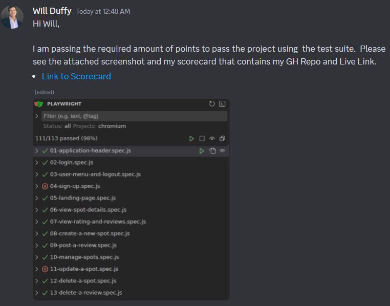
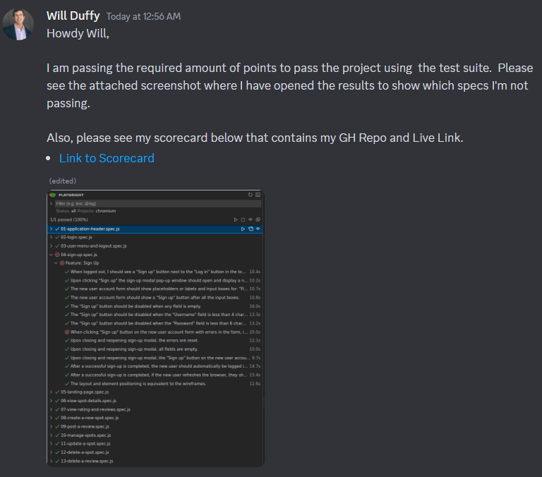

# How to Turn in your Test Suite Results for Grading

> ⚠️ This only applies to the grading procedure if you're using the test suite to confirm your score. Regular grading follows the standard project submission procedure.

If you use the test suite to confirm you're passing, here's how you can turn in your results:

1. Take a screenshot of the test suite results.
2. Send me the screenshot, and your scorecard that should include your GH Repo Link and your Live Link.
3. You are done!

I will review your screenshot results, repo, and live link and mark you as passing. The test specs ultimately mimic what I'd be doing to grade your project, but in a consistent and reproducible way. Therefore, if you're passing this test suite, you're passing the M5 project.

## Examples of Turning in Results
### Single Test Run with Enough Points
If you were able to run all the specs at once, and get enough points to pass, you can send me a screenshot of the results like the one below where it shows (101+/113) points.

### Multiple Test Runs Showing Remaining Errors
If you had to rerun specs, so your total score isn't showing (101+/113), you can send me a screenshot where you open the results to show the errors that remain (if any).

Notice that you only need to expand sections that have errors. Also, note that the score shows (1/1), but every section is green except for the ones that have errors.

## Academic Integrity

Please do not attempt to alter the results in your screenshot to inflate your score. It's very easy to detect if the results were modified by taking a quick scan through your GH repo.

I will have to automatically fail your Project, and open a Code of Conduct violation which can result in your dismissal from the program. So please just don't do it 🙏
