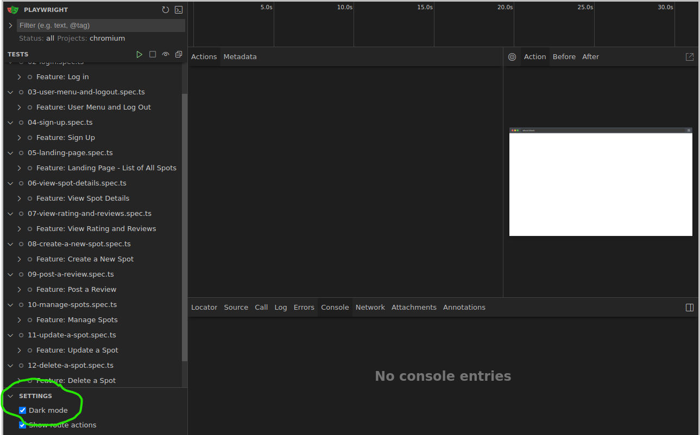
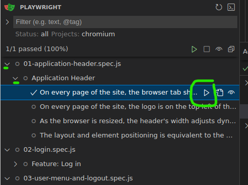
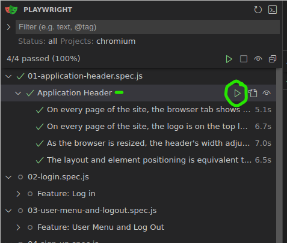
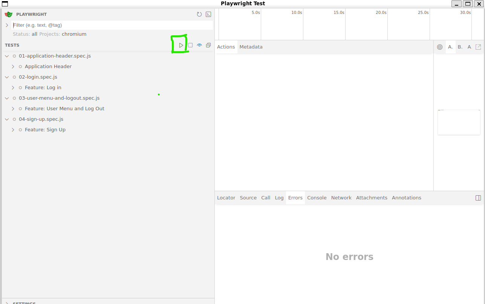
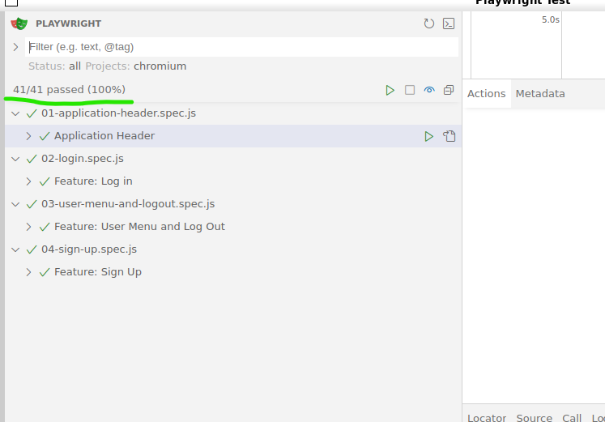
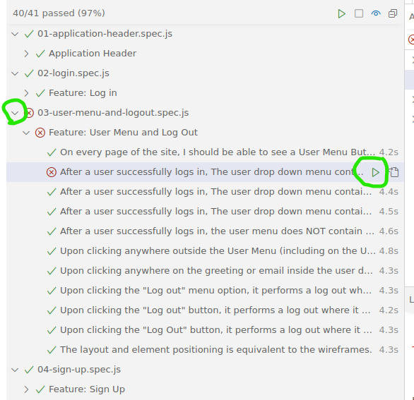

# M5 Test Specs

This repository contains the test specs for the M5 project.  These tests are written using [Playwright](https://playwright.dev/docs/intro).

⭐ Note: Since everyone's project will be different, the tests depend on data attributes to identify elements.  Please see the below for more details.


## Setup and Usage
You can watch the walkthrough video on 2x speed in addition to the below instructions.

### Install Playwright and Dependencies
- `npm install`
- `npx playwright install --with-deps chromium`

### Add Environment Variables
Copy the `.env.example` file to a `.env` and add your test url:
- `cp .env.example .env`

### Use the Specs Locally
Start by running your backend and frontend.  The starter comes with the `STUDENT_URL` env variable set to `http://localhost:5173`.  So ensure your dev server is on this port or modify your `.env` if it's not.

You do not need to retest this test suite in production.  You can run the specs locally to confirm you're getting points, and then push your code to production when you're done. (Remember to run `npm run build` before pushing to production).


### Running the tests
> ⚠️ Before running the below command, please read the below section on adding test identifiers.
- `npx playwright test --ui`

## ⭐ Adding Test Identifiers ⭐

Since everyone's project will be different, we can add attributes to elements so that Playwright can easily identify your interactive elements.

### 💡Every Identifier you need is in the `constants.js` file.

To add test identifiers, use the `data-testid` attribute.  To find the identifiers you'll need, you can check the test spec files in the `tests` directory.

Here is an example where identifiers are added to the login form:

```js
<form onSubmit={handleSubmit}>
  <label>
    Username or Email
    <input
      type="text"
      data-testid='credential-input' // Identifier
      value={credential}
      onChange={(e) => setCredential(e.target.value)}
      required
    />
  </label>
  <label>
    Password
    <input
      type="password"
      data-testid='password-input' // Identifier
      value={password}
      onChange={(e) => setPassword(e.target.value)}
      required
    />
  </label>
  {errors.credential && <p>{errors.credential}</p>}
  <button
  type="submit"
  data-testid='login-button' // Identifier
  >
  Log In
  </button>
</form>
```

And here's how you'll see these used in the test specs:
```js
await page.getByTestId('credential-input').fill('demo@user.io')
await page.getByTestId('password-input').fill('password')
await page.getByTestId('login-button').click()
```


## Quickstart -- Working with UI Mode

> 💡Enable Dark Mode



## 🌟Before you start, read the section above regarding identifiers if you haven't already.🌟

Begin by only running individual tests for any given section to build up your familiarity with how they work, and what's happening in the section.



---

Once you start feeling comfortable with a section, you can move up to the group of tests for the section.



---

### **Important**: Prefer running the tests individually or in smaller groups, instead of running the entire suite of tests.

Once you are comfortable working with the specs, you can click the green arrow circled in the screenshot below to run all tests:



---

Here is a screenshot where all tests are passing:



> 📖 You can read more details about UI Mode here: https://playwright.dev/docs/test-ui-mode#opening-ui-mode

## Rerun Failed Tests

Click the dropdown arrow circled in the screenshot below to open a specific spec.

Rerun failed tests by clicking the green arrow circled in the screenshot below.



---

 You can also rerun all tests for a spec by clicking the play button next to the spec name.


