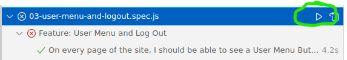

# M5 Test Specs (Early Access)

This repository contains the test specs for the M5 project.  These tests are written using [Playwright](https://playwright.dev/docs/intro).

⭐ Note: Since everyone's project will be different, the tests depend on data attributes to identify elements .

> ⚠️ These tests are currently a work in progress. Please report any issues you find.  Thank you!

## Setup and Usage

- Install the dependencies: `npm install`
- Copy the `.env.example` file to a `.env` and add your test url: `cp .env.example .env`
  - I currently have the test url set to `http://localhost:5173`,but you can change this to your Render url.

- If you're testing locally, start by running your backend and frontend.
  - You'll need ensure your app is running before running the test specs.

- To run the test specs use: `npx playwright test --ui`
  - Please see the below section on adding test identifiers for more information on how to use Playwright to identify elements.

## Adding Test Identifiers ⭐

Since everyone's project will be different, we can add attributes to elements so that Playwright can easily identify your interactive elements.

To add test identifiers, use the `data-testid` attribute.  To find the identifiers you'll need, you can check the test spec files in the `tests` directory.

Here is an example where identifiers are added to the login form:

```js
<>
      <form onSubmit={handleSubmit}>
        <label>
          Username or Email
          <input
            type="text"
            data-testid='credential-input' // Identifier
            value={credential}
            onChange={(e) => setCredential(e.target.value)}
            required
          />
        </label>
        <label>
          Password
          <input
            type="password"
            data-testid='password-input' // Identifier
            value={password}
            onChange={(e) => setPassword(e.target.value)}
            required
          />
        </label>
        {errors.credential && <p>{errors.credential}</p>}
        <button
        type="submit"
        data-testid='login-button' // Identifier
        >
        Log In
        </button>
      </form>
</>
```


## Quickstart -- Working with UI Mode

Click the green arrow circled in the screenshot below to run all tests:


Here is a screenshot where all tests are passing:


> 📖 You can read more details about UI Mode here: https://playwright.dev/docs/test-ui-mode#opening-ui-mode

## Rerun Failed Tests

Click the dropdown arrow circled in the screenshot below to open a specific spec.

Rerun failed tests by clicking the green arrow circled in the screenshot below.


 You can also rerun all tests for a spec by clicking the play button next to the spec name.



## Report Issues

If you find any issues with the tests, please DM me the details.
